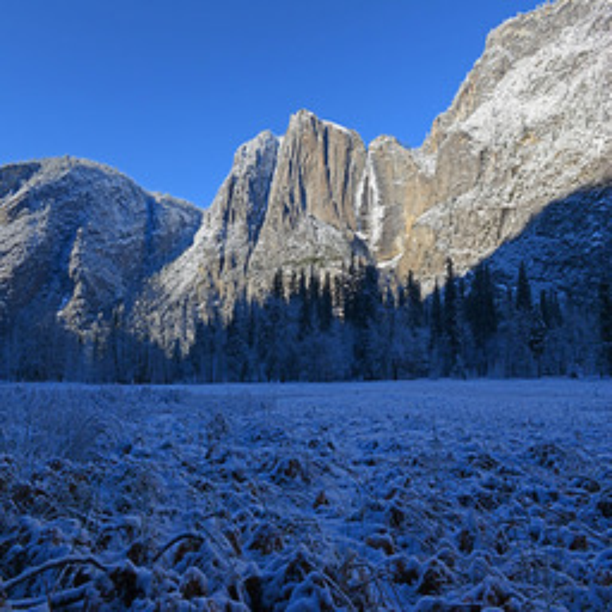

# cycle GAN

This is a cycle GAN implementation, was trained for 15 epochs. The task is to switch a picture of summer to winter and vice versa. Is seems to slowly converge however the output images are full of artifacts. If trained slower and for longer these would most likely lessen.

## Ex1
### Winter

### Summer

## Ex2
### Winter

### Summer

## Ex3
### Summer

### Winter
