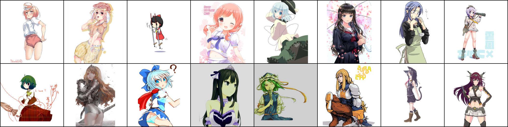
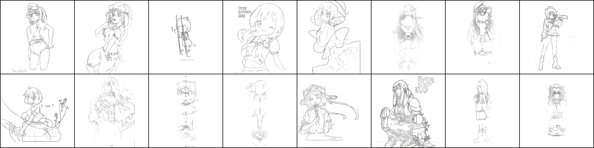
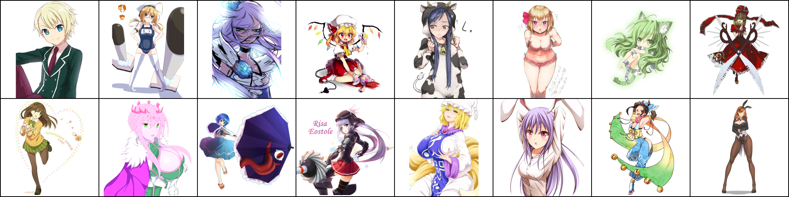
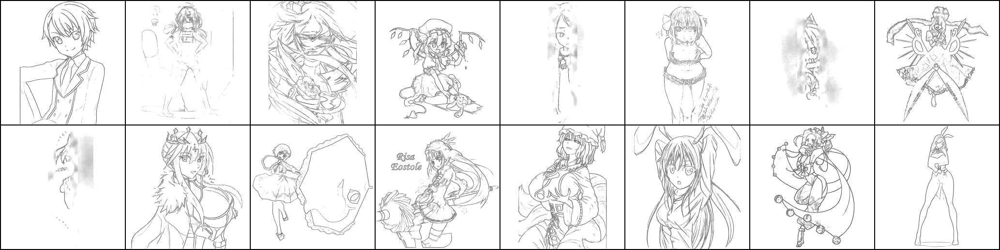

This is a Pix 2 Pix implementation, was trained for 51 epochs and it is converging on most pictures, there are a few artifacts in some of them. If trained slower and for longer these would most likely disappear

## Epoch 9
### Input

### Output

## Epoch 51
### Input

### Output
