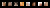
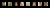

# pro GAN

This is a pro GAN implementation. Was trained for 77 epochs and does seems to converge however since the training resources were limited the amount of training for each up sampling step was decreased. This means that the later images are not as good as they should be. However this still shows that the architecture works.

# Upsample 1 epoch 22
## Real

## FAKE

# Upsample 2 epoch 38
## Real

## FAKE

# Upsample 3 epoch 50
## Real

## FAKE

# Upsample 4 epoch 65
## Real

## FAKE

# Upsample 5 epoch 77
## Real

## FAKE
