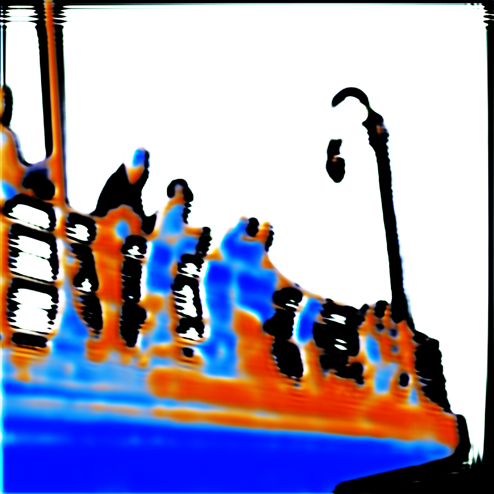
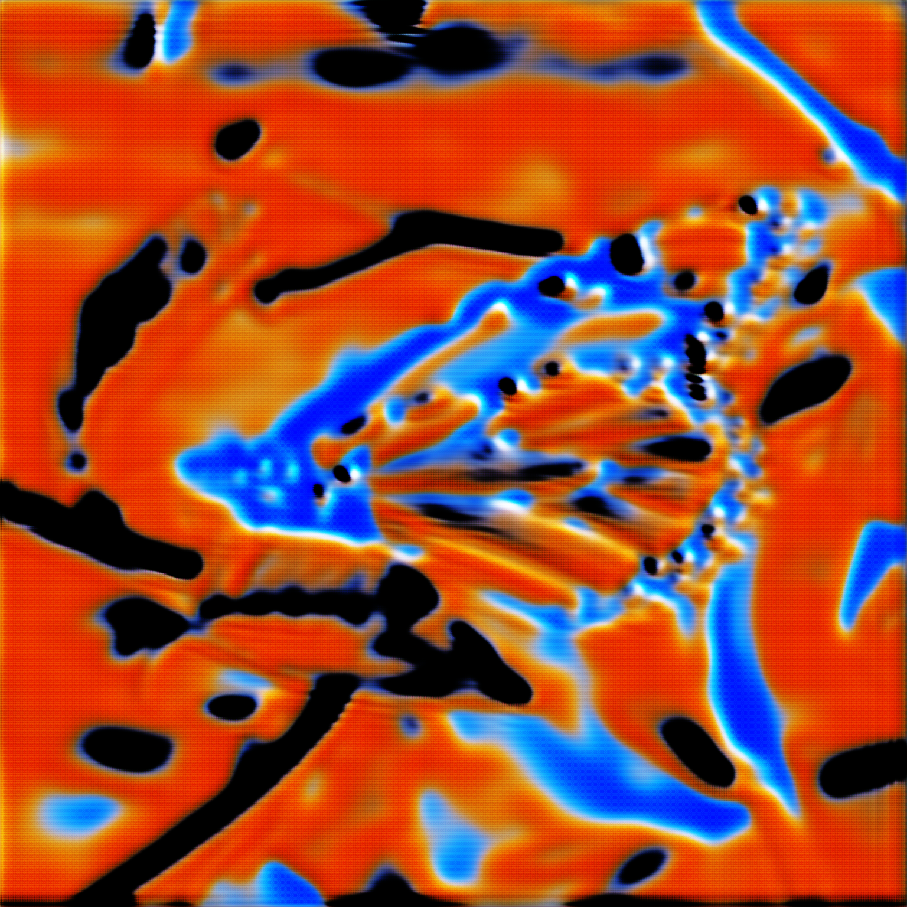

# SR GAN
Trained for enough epochs to see results however did not converge. Possible that if trained slower and lower learing rate it might converge better but the results do not look promising

# Example of input

# Outputs

# Epoch 25

# Epoch 101

