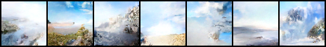
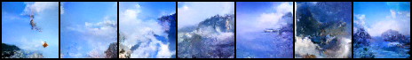
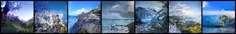

# Stable diff 

This implementation does it with Attention unet but does not have VAR so does not use latent spaces. Due to limited training resources the outputs are not as good as they could be however, it is clear that the model does converge. There are still a lot of artifacts and the image size is small due to not using latent spaces and up sampling

# Example outputs

# Example dataset

.jpg)

